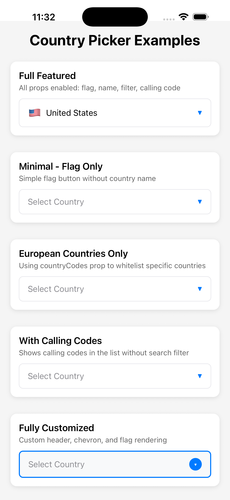
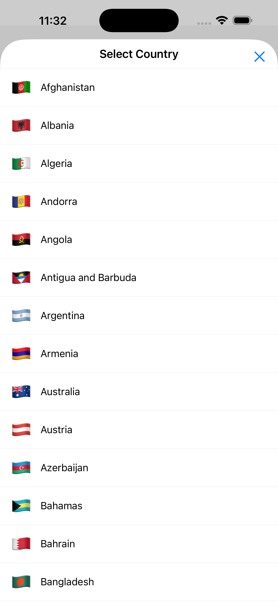
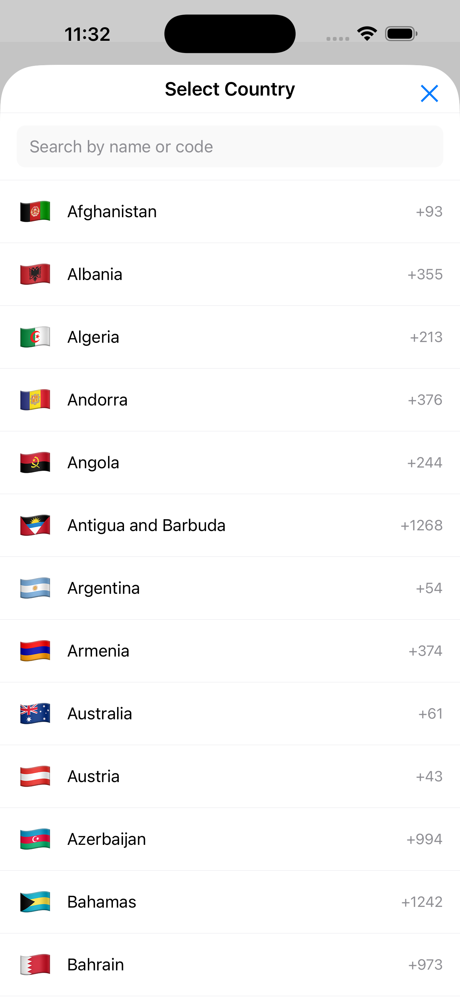
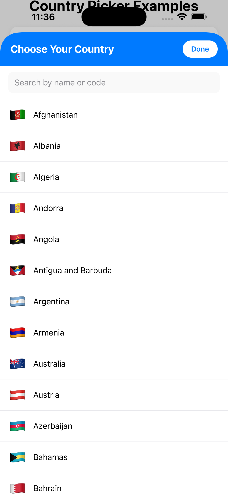

# react-native-simple-country-picker

A flexible and customizable country picker component for React Native with search functionality, calling codes, and custom rendering options.

## Features

- Complete country data including flags, names, ISO codes, calling codes, and currencies
- Searchable country list with instant filtering
- Display calling codes in picker button and list
- **Imperative ref API** for programmatic modal control
- Customizable button appearance
- Modal-based picker interface
- Support for country whitelisting
- Custom rendering for flags and chevron icons
- **Localization support** with 4 UI languages (English, Spanish, French, German) and 6 country name languages
- TypeScript support with full type definitions
- Zero dependencies (pure React Native)
- iOS and Android support

## Screenshots

<div style="display: flex; gap: 20px;">
  
  
  
  
</div>

## Installation

```sh
npm install react-native-simple-country-picker
```

or

```sh
yarn add react-native-simple-country-picker
```

## Basic Usage

```tsx
import React, { useState } from 'react';
import CountryPicker, { Country } from 'react-native-simple-country-picker';

function MyComponent() {
  const [selectedCountry, setSelectedCountry] = useState<Country | null>(null);

  return (
    <CountryPicker
      withFlag
      withCountryNameButton
      withFilter
      onSelect={(country) => setSelectedCountry(country)}
    />
  );
}
```

## Props

| Prop | Type | Default | Description |
|------|------|---------|-------------|
| `onSelect` | `(country: Country) => void` | **required** | Callback when a country is selected |
| `withFlag` | `boolean` | `false` | Show flag emoji on the button |
| `withCountryNameButton` | `boolean` | `false` | Show country name on the button |
| `withFilter` | `boolean` | `false` | Enable search functionality in the modal |
| `withCallingCode` | `boolean` | `false` | Show calling codes in the country list |
| `countryCode` | `string` | `undefined` | Initial selected country (ISO 3166-1 alpha-2) |
| `countryCodes` | `string[]` | `undefined` | Whitelist of countries to display |
| `onOpen` | `() => void` | `undefined` | Callback when modal opens |
| `onClose` | `() => void` | `undefined` | Callback when modal closes |
| `containerStyle` | `ViewStyle` | `undefined` | Style for the main container |
| `buttonStyle` | `ViewStyle` | `undefined` | Style for the button |
| `modalStyle` | `ViewStyle` | `undefined` | Style for the modal |
| `countryNameStyle` | `TextStyle` | `undefined` | Style for country name and calling code text in button |
| `renderChevron` | `() => ReactNode` | `undefined` | Custom chevron/dropdown icon renderer |
| `renderFlag` | `(country: Country) => ReactNode` | `undefined` | Custom flag renderer |
| `renderHeader` | `(onClose: () => void) => ReactNode` | `undefined` | Custom modal header renderer |
| `placeholder` | `string` | `'Select Country'` | Placeholder text when no country is selected |
| `placeholderStyle` | `TextStyle` | `undefined` | Style for placeholder text in button |

## Imperative API

You can control the modal programmatically using a ref:

```typescript
interface CountryPickerRef {
  open: () => void;   // Opens the country picker modal
  close: () => void;  // Closes the country picker modal
}
```

## Examples

### Full Featured Picker

```tsx
<CountryPicker
  withFlag
  withCountryNameButton
  withFilter
  withCallingCode
  countryCode="US"
  onSelect={(country) => console.log('Selected:', country)}
  onOpen={() => console.log('Picker opened')}
  onClose={() => console.log('Picker closed')}
/>
```

### Minimal Flag-Only Picker

```tsx
<CountryPicker
  withFlag
  onSelect={(country) => console.log('Selected:', country)}
/>
```

### With Calling Codes

```tsx
<CountryPicker
  withFlag
  withCountryNameButton
  withCallingCode
  onSelect={(country) => console.log('Selected:', country)}
/>
```

### Filtered to Specific Countries

```tsx
<CountryPicker
  withFlag
  withCountryNameButton
  withFilter
  countryCodes={['US', 'CA', 'MX', 'GB', 'FR', 'DE']}
  onSelect={(country) => console.log('Selected:', country)}
/>
```

### Imperative Control with Ref

```tsx
import { useRef } from 'react';
import CountryPicker, { CountryPickerRef } from 'react-native-simple-country-picker';
import { Button } from 'react-native';

function MyComponent() {
  const pickerRef = useRef<CountryPickerRef>(null);

  return (
    <>
      <CountryPicker
        ref={pickerRef}
        withFlag
        withCountryNameButton
        withFilter
        onSelect={(country) => console.log('Selected:', country)}
      />

      <Button
        title="Open Picker"
        onPress={() => pickerRef.current?.open()}
      />

      <Button
        title="Close Picker"
        onPress={() => pickerRef.current?.close()}
      />
    </>
  );
}
```

### Custom Chevron Icon

```tsx
import { Image } from 'react-native';

<CountryPicker
  withFlag
  withCountryNameButton
  onSelect={(country) => console.log('Selected:', country)}
  renderChevron={() => (
    <Image
      source={require('./assets/chevron-down.png')}
      style={{ width: 12, height: 12 }}
    />
  )}
/>
```

### Custom Flag Renderer

```tsx
import { Image } from 'react-native';

<CountryPicker
  withFlag
  withCountryNameButton
  onSelect={(country) => console.log('Selected:', country)}
  renderFlag={(country) => (
    <Image
      source={{ uri: `https://flagcdn.com/w40/${country.code.toLowerCase()}.png` }}
      style={{ width: 24, height: 16, marginRight: 8 }}
    />
  )}
/>
```

### Custom Modal Header

```tsx
import { View, Text, TouchableOpacity } from 'react-native';

<CountryPicker
  withFlag
  withCountryNameButton
  withFilter
  onSelect={(country) => console.log('Selected:', country)}
  renderHeader={(onClose) => (
    <View style={{
      flexDirection: 'row',
      alignItems: 'center',
      justifyContent: 'space-between',
      padding: 16,
      backgroundColor: '#007AFF',
    }}>
      <Text style={{ fontSize: 18, fontWeight: 'bold', color: '#FFF' }}>
        Choose Country
      </Text>
      <TouchableOpacity onPress={onClose}>
        <Text style={{ color: '#FFF', fontSize: 16 }}>Done</Text>
      </TouchableOpacity>
    </View>
  )}
/>
```

### Custom Placeholder Text

```tsx
<CountryPicker
  withFlag
  withCountryNameButton
  onSelect={(country) => console.log('Selected:', country)}
  placeholder="Choose your country"
  placeholderStyle={{
    fontSize: 16,
    fontStyle: 'italic',
    color: '#999',
  }}
/>
```

### Custom Styling

```tsx
<CountryPicker
  withFlag
  withCountryNameButton
  onSelect={(country) => console.log('Selected:', country)}
  containerStyle={{ marginVertical: 20 }}
  buttonStyle={{
    backgroundColor: '#f0f0f0',
    borderRadius: 12,
    paddingVertical: 16,
  }}
  countryNameStyle={{
    fontSize: 18,
    fontWeight: 'bold',
    color: '#007AFF',
  }}
/>
```

### Fully Customized Example

```tsx
import { View, Text, TouchableOpacity } from 'react-native';

<CountryPicker
  withFlag
  withCountryNameButton
  withFilter
  onSelect={(country) => console.log('Selected:', country)}
  renderChevron={() => (
    <View style={{
      backgroundColor: '#007AFF',
      borderRadius: 12,
      width: 24,
      height: 24,
      alignItems: 'center',
      justifyContent: 'center',
    }}>
      <Text style={{ color: '#FFF', fontSize: 14 }}>▾</Text>
    </View>
  )}
  renderFlag={(country) => (
    <View style={{
      backgroundColor: '#007AFF',
      borderRadius: 4,
      paddingHorizontal: 8,
      paddingVertical: 4,
      marginRight: 8,
    }}>
      <Text style={{ color: '#FFF', fontSize: 12, fontWeight: 'bold' }}>
        {country.code}
      </Text>
    </View>
  )}
  renderHeader={(onClose) => (
    <View style={{
      flexDirection: 'row',
      justifyContent: 'space-between',
      padding: 16,
      backgroundColor: '#007AFF',
    }}>
      <Text style={{ fontSize: 20, fontWeight: 'bold', color: '#FFF' }}>
        Choose Your Country
      </Text>
      <TouchableOpacity onPress={onClose}>
        <Text style={{ color: '#FFF' }}>Done</Text>
      </TouchableOpacity>
    </View>
  )}
/>
```

## Country Object

The `Country` object returned by `onSelect` has the following structure:

```typescript
interface Country {
  code: string;           // ISO 3166-1 alpha-2 (e.g., "US")
  name: string;           // Country name in English (e.g., "United States")
  callingCode: string;    // E.164 format (e.g., "+1")
  flag: string;           // Emoji flag (e.g., "🇺🇸")
  currency?: string;      // ISO 4217 code (e.g., "USD")
  names?: Record<string, string>; // Translated country names (e.g., { es: "Estados Unidos", fr: "États-Unis" })
}
```

## Localization

The country picker supports multiple languages for UI strings and country names.

### UI Languages

Supported UI languages: **English (en)**, **Spanish (es)**, **French (fr)**, **German (de)**

### Country Name Languages

Country names are translated in 6 languages: **English**, **Spanish**, **French**, **German**, **Portuguese**, **Italian**, **Japanese**

### Using Localization

```tsx
// Spanish UI and country names
<CountryPicker
  language="es"
  withFlag
  withCountryNameButton
  onSelect={(country) => console.log('Selected:', country)}
/>

// Dynamic language switching
const [language, setLanguage] = useState('en');

<CountryPicker
  language={language}
  withFlag
  withCountryNameButton
  onSelect={(country) => console.log('Selected:', country)}
/>

// Custom translations
<CountryPicker
  language="en"
  translations={{
    searchPlaceholder: 'Find a country...',
    headerTitle: 'Choose Your Country',
    noCountriesFound: 'No matches found',
  }}
  withFlag
  withCountryNameButton
  withFilter
  onSelect={(country) => console.log('Selected:', country)}
/>
```

### Accessing Translation Utilities

For advanced use cases, you can use the translation utilities directly:

```tsx
import CountryPicker, {
  getTranslations,
  getCountryName,
} from 'react-native-simple-country-picker';

// Get UI translations for a language
const translations = getTranslations('es');
console.log(translations.headerTitle); // "Seleccionar País"

// Get translated country name
const country = { code: 'US', name: 'United States', flag: '🇺🇸', callingCode: '+1' };
const spanishName = getCountryName(country, 'es'); // "Estados Unidos"
```

## TypeScript

This library is written in TypeScript and exports all necessary types:

```typescript
import CountryPicker, {
  Country,
  CountryPickerProps,
  CountryPickerRef,
  Translations,
  getTranslations,
  getCountryName,
} from 'react-native-simple-country-picker';
```

## Contributing

- [Development workflow](CONTRIBUTING.md#development-workflow)
- [Sending a pull request](CONTRIBUTING.md#sending-a-pull-request)
- [Code of conduct](CODE_OF_CONDUCT.md)

## License

MIT

## Author

[ctriantaf](https://github.com/ctriantaf)

---

Made with [create-react-native-library](https://github.com/callstack/react-native-builder-bob)
